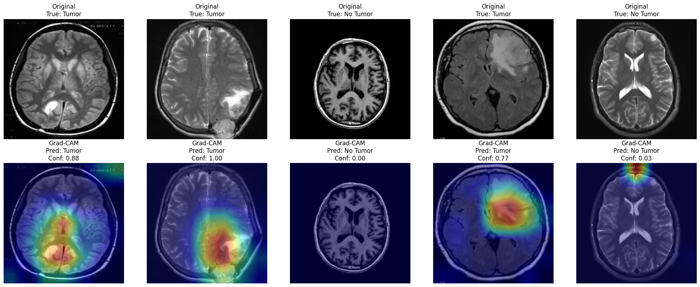
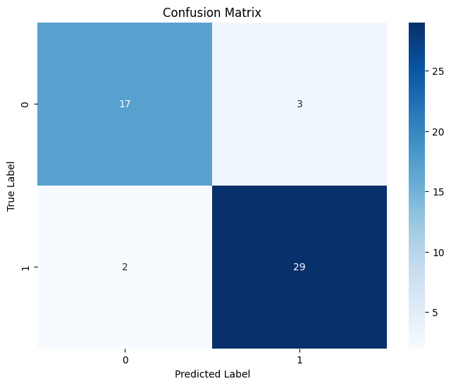

# Medical Image Classification Research Project

This repository contains various experiments and implementations for medical image classification tasks using deep learning approaches. The project explores different medical imaging modalities and classification challenges in healthcare.

## Project Overview
This research project focuses on developing and evaluating deep learning models for various medical image classification tasks. The repository includes implementations, experimental results, and performance analyses for different medical imaging applications.

## Brain Tumor Detection Example

One of our implemented tasks is brain tumor detection, which demonstrates the potential of deep learning in medical image analysis. Using a CNN-based classification model with Grad-CAM visualization, we developed a system to detect the presence of tumors in brain MRI scans.

### Model Performance

- **Accuracy**: 90%
- **Precision**: 
  - No Tumor: 89%
  - Tumor: 91%
- **Recall**:
  - No Tumor: 85%
  - Tumor: 94%
- **F1-Score**:
  - No Tumor: 87%
  - Tumor: 92%

### Visualization Results



The image above demonstrates our model's predictions. For each case:
- Top row: Original MRI scan
- Bottom row: Grad-CAM visualization highlighting regions of model attention

Key observations:
- High confidence predictions (0.77-1.00) for cases with tumors
- Low false detection rate in normal cases
- Grad-CAM visualizations confirm the model's focus on actual tumor locations

### Training Progress



During the training process:
- Stable learning curves over 30 epochs
- Achieved validation accuracy above 90%
- Consistent decrease in both training and validation loss without overfitting

## Project Structure
- `data/`: Contains different medical imaging datasets
- `notebooks/`: Experimental Jupyter notebooks for various classification tasks
- `src/`: Source code for models and utilities
- `outputs/`: Saved models, results, and visualizations for different experiments

## Environment Setup
- Create VENV using desired python version: ```conda create -n <env_name> python=<version>```
- Create VENV using environment.yaml: ```conda env create -f environment.yaml```
- Installation using requirements.txt: ```pip install -r requirements.txt```
- For torch installation: ```pip3 install torch torchvision torchaudio```
- Save the environment: ```conda env export > environment.yaml```

## Ongoing Research
This repository is actively maintained with new experiments and implementations for various medical image classification tasks, including:
- Chest X-ray classification
- Skin lesion detection
- Retinal disease classification
- And more...

## References
- [Add relevant papers and resources]